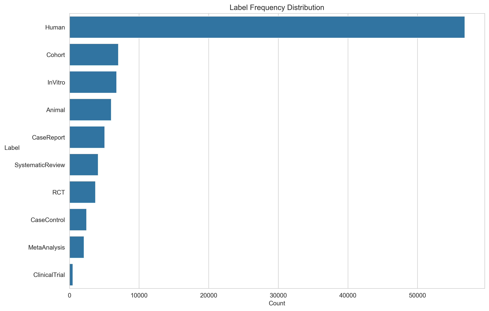
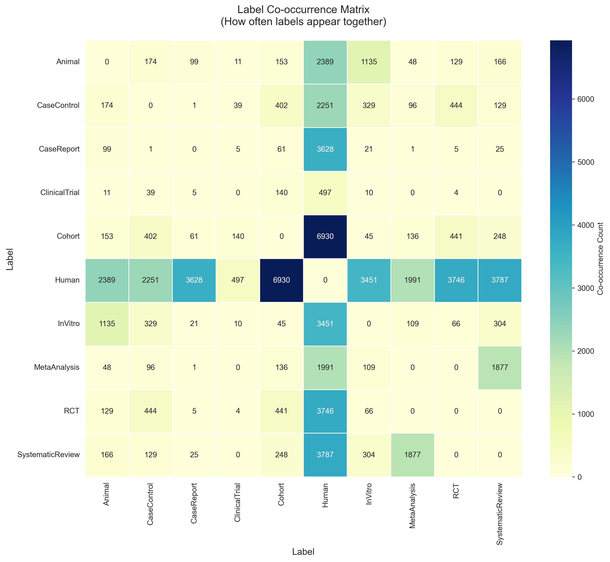

# 🦷 Dental Evidence Triage — A Multi-label Study-Design Classifier for PubMed Dental Abstracts

<div align="center">


**Instantly classify dental research abstracts by study design using transformer-based multi-label classification**

[🎯 Overview](#-project-overview) • [📊 Results](#-results) • [🚀 Quick-Start](#-quickstart) • [📓 Notebooks](#-notebooks)

</div>

---

## 👨‍💻 Author

<div align="center">

**Francisco Teixeira Barbosa**

[](https://github.com/Tuminha)
[](https://www.kaggle.com/franciscotbarbosa)
[](mailto:cisco@periospot.com)
[](https://twitter.com/cisco_research)

*Learning Machine Learning through CodeCademy • Building AI solutions step by step*

</div>

---

## 🎯 Project Overview

**Problem**

When scanning literature, the first question is *"what kind of evidence is this?"* (Systematic review? RCT? Case report?). That decision is slow if you must open PDFs.

**Solution**

A compact transformer that reads **title + abstract** and predicts **study design**:

`[SystematicReview, MetaAnalysis, RCT, ClinicalTrial, Cohort, CaseControl, CaseReport, InVitro, Animal, Human]`

**What this repo contains**

- A reproducible pipeline to **ingest PubMed**, **normalize records**, **map Publication Types to labels**, and **split** by year.
- A **multi-label classifier** (DistilBERT) trained on those labels.
- A **Hugging Face push** notebook + a **paste-an-abstract** inference demo.

### 🎓 Learning Objectives

- Master end-to-end NLP pipeline: data acquisition → labeling → training → deployment
- Understand multi-label classification with transformers
- Practice temporal splits to prevent data leakage
- Deploy models to Hugging Face Hub with proper documentation
- Build assistive AI tools for clinical research triage

### 🏆 Key Achievements

- [x] **Notebook 01** - Complete PubMed ingestion pipeline (400 XML files, ~76,165 articles)
- [x] **Notebook 02** - Data normalization and multi-label mapping (64,981 labeled articles, 85.3% coverage)
- [x] **Notebook 03** - EDA, label analysis, and temporal splits (Train: 29,926 / Val: 16,057 / Test: 18,666)
- [x] **Notebook 04** - Data preparation complete (label binarization, tokenization, HF Dataset conversion)
- [x] **Notebook 04** - Model setup complete (model initialization, metrics function, training args, trainer)
- [ ] DistilBERT classifier training completion and evaluation
- [ ] Micro-F1 ≥ 0.75 on common labels
- [ ] Hugging Face Hub deployment with inference widget
- [ ] Error analysis and threshold optimization

---

## 📊 Dataset / Domain

- **Source:** PubMed E-utilities (NCBI)
- **Scope:** Dental research (periodontology, implants, endodontics, orthodontics, oral surgery)
- **Time Range:** 2018–2025 (configurable)
- **Total Articles:** 76,165 articles ingested
- **Labeled Articles:** 64,981 articles (85.3% coverage)
- **Target:** Multi-label study design classification
- **Labels:** 10 canonical categories (SystematicReview, MetaAnalysis, RCT, ClinicalTrial, Cohort, CaseControl, CaseReport, InVitro, Animal, Human)
- **Label Distribution:**
  - Human: 56,804 articles (74.6%)
  - Cohort: 7,035 articles (9.2%)
  - InVitro: 6,786 articles (8.9%)
  - Animal: 6,019 articles (7.9%) - perfect match with MeSH
  - CaseReport: 5,084 articles (6.7%)
  - SystematicReview: 4,128 articles (5.4%)
  - RCT: 3,759 articles (4.9%)
  - CaseControl: 2,460 articles (3.2%)
  - MetaAnalysis: 2,110 articles (2.8%)
  - ClinicalTrial: 503 articles (0.7%)

See [DATACARD.md](DATACARD.md) for detailed data documentation.

---

## 📊 Exploratory Data Analysis (EDA)

### Label Frequency Distribution

The dataset shows a heavily skewed distribution with **Human** label dominating (74.6% of articles), which is expected in medical research. The distribution follows the evidence hierarchy, with common study designs (Cohort, InVitro, Animal, CaseReport) having moderate frequencies, while high-quality evidence types (RCT, SystematicReview, MetaAnalysis) are rarer but present.

<div align="center">



</div>

**Key Insights:**
- **Human label:** 56,804 articles (74.6%) - dominant, expected in medical research
- **Common labels:** Cohort (9.2%), InVitro (8.9%), Animal (7.9%), CaseReport (6.7%)
- **Moderate labels:** SystematicReview (5.4%), RCT (4.9%), CaseControl (3.2%)
- **Rare labels:** MetaAnalysis (2.8%), ClinicalTrial (0.7%) - will need special handling
- **Class imbalance ratio:** 113:1 (Human:ClinicalTrial) - extreme but manageable

### Label Co-occurrence Matrix

The co-occurrence matrix reveals important multi-label patterns. **Human** is a central label, co-occurring frequently with other study designs. **Cohort + Human** is the strongest pairing (6,930 articles), indicating that cohort studies typically involve human subjects.

<div align="center">



</div>

**Key Insights:**
- **Cohort + Human:** 6,930 articles (strongest pairing)
- **Human + RCT:** 3,746 articles (RCTs with human subjects)
- **Human + SystematicReview:** 3,787 articles (systematic reviews of human studies)
- **Human + CaseReport:** 3,628 articles (case reports on human subjects)
- **Animal + Human:** 2,389 articles (comparative/translational studies)
- **MetaAnalysis + SystematicReview:** 1,877 articles (meta-analyses within systematic reviews)

### Temporal Splits

**Split Distribution:**
- **Train (≤2021):** 29,926 articles (46.3%)
- **Val (2022-2023):** 16,057 articles (24.8%)
- **Test (≥2024):** 18,666 articles (28.9%)

**Why these splits?**
- **Temporal leakage prevention:** Future data never influences past predictions
- **Realistic deployment:** Mimics real-world scenario (predicting future papers)
- **Sufficient data:** All splits have >15,000 articles (more than enough for training)
- **Realistic distribution:** Reflects actual publication trends (recent years have more data)

---

## 🚀 Quickstart

### Prerequisites

```bash
python -m venv .venv && source .venv/bin/activate
pip install -r requirements.txt
```

### Environment Setup

Recommended for NCBI rate limits:

```bash
export NCBI_EMAIL="you@example.com"
export NCBI_API_KEY="your_ncbi_key"
```

Get your API key at: https://www.ncbi.nlm.nih.gov/account/settings/

### Usage

Work through notebooks in order (01 → 07):

```bash
jupyter notebook notebooks/
```

1. `01_ingest_pubmed.ipynb` — Fetch raw XML from PubMed
2. `02_normalize_and_label.ipynb` — Parse and label records
3. `03_eda_and_splits.ipynb` — Explore data and create temporal splits
4. `04_train_distilbert_multilabel.ipynb` — Train classifier
5. `05_eval_and_error_analysis.ipynb` — Evaluate and analyze errors
6. `06_push_to_huggingface.ipynb` — Deploy to Hugging Face Hub
7. `07_inference_demo.ipynb` — Interactive inference demo

---

## 📓 Notebooks

### Phase 1: Data Acquisition ✅

**01 - Ingest PubMed Records** (Complete)
- ✅ Query construction with dental MeSH terms
- ✅ ESearch API integration with pagination
- ✅ Rate limiting and error handling
- ✅ NCBI 10K result limit handling
- ✅ Batch XML retrieval (efetch function)
- ✅ XML storage for reproducibility (400 XML files)
- ✅ 76,165 articles ingested across 2018-2025

### Phase 2: Data Preparation & EDA ✅

**02 - Normalize and Label** (Complete)
- ✅ MEDLINE XML parsing with XPath
- ✅ Publication Type → label mapping (10 canonical labels)
- ✅ MeSH term integration for Human and Animal labels
- ✅ Keyword-based backfill for InVitro/Human labels
- ✅ Label distribution analysis and validation
- ✅ Over-matching detection and correction (Animal label fixed)
- ✅ Multi-label combination analysis
- ✅ Data filtering and saving (64,981 labeled articles)
- ✅ Output: `data/processed/dental_abstracts.parquet`

**03 - EDA and Temporal Splits** (Complete)
- ✅ Label frequency distribution analysis
- ✅ Class imbalance assessment (Human:ClinicalTrial = 113:1)
- ✅ Label co-occurrence matrix visualization
- ✅ Temporal split creation (Train: ≤2021, Val: 2022-2023, Test: ≥2024)
- ✅ Split validation and distribution analysis
- ✅ Label distribution across splits verification
- ✅ Pandera schema validation
- ✅ Output: `data/processed/train.parquet`, `val.parquet`, `test.parquet`

### Phase 3: Model Training 🔄

**04 - Train DistilBERT Multi-label** (In Progress)
- ✅ Canonical label list defined (10 labels matching notebook 02)
- ✅ Data loading: train/val/test splits loaded and text columns created (title + abstract, truncated to 2000 chars)
- ✅ Label binarization: Multi-hot binary vectors created for all splits
- ✅ HuggingFace Dataset creation: Converted pandas DataFrames to HF Dataset format
- ✅ Tokenization: DistilBERT tokenizer applied with max_length=512, truncation, padding
- ✅ Dataset formatting: Set to PyTorch format with input_ids, attention_mask, labels
- ✅ Model initialization: DistilBERT loaded with num_labels=10, problem_type='multi_label_classification'
- ✅ Metrics function: Implemented compute_metrics() with sigmoid thresholding and micro/macro F1
- ✅ Training arguments: Configured TrainingArguments (learning_rate=2e-5, batch_size=8, epochs=3, etc.)
- ✅ Trainer setup: Created Trainer with model, datasets, and compute_metrics
- 🔄 Model training: Training in progress (3 epochs, evaluating each epoch, saving best model based on micro-F1)

**05 - Evaluation and Error Analysis**
- Per-label precision/recall/F1
- PR curves and threshold tuning
- Qualitative error inspection

### Phase 4: Deployment 📦

**06 - Push to Hugging Face Hub**
- Model card generation
- Hub upload with metadata
- Inference widget configuration

**07 - Inference Demo**
- Interactive Gradio interface
- PMID-based abstract fetching
- Real-time predictions

---

## 🏆 Results

*Coming soon after model training*

Expected targets:
- **Micro-F1:** ≥ 0.75 on common labels (SR/Meta/RCT/CaseReport)
- **Macro-F1:** Lower due to rare labels
- **Per-label AP:** Varies by class prevalence

### 📌 Business Interpretation

- **For Researchers:** Quickly triage literature by evidence strength
- **For Systematic Reviews:** Pre-filter abstracts before full-text screening
- **For Curriculum:** Generate study-design balanced datasets
- **For Retrieval:** Enhance PubMed searches with predicted study types

---

## 🛠 Technical Stack

| Component | Technology | Purpose |
|-----------|------------|---------|
| Data Acquisition | NCBI E-utilities API | PubMed metadata retrieval |
| Data Processing | Pandas, NumPy | ETL & feature engineering |
| XML Parsing | lxml | MEDLINE XML parsing |
| Visualization | Matplotlib, Seaborn | EDA & results plotting |
| ML Framework | PyTorch, Transformers | Model training |
| Model | DistilBERT | Multi-label classification |
| Evaluation | scikit-learn, evaluate | Metrics computation |
| Deployment | Hugging Face Hub | Model hosting & inference |
| Demo | Gradio | Interactive UI |
| Validation | Pandera | Schema validation |

---

## 📝 Notes on Ethics & Licensing

- **Data Source:** We use PubMed metadata (titles/abstracts/Publication Types, MeSH). Redistribution as derived data is permitted under NCBI guidelines.
- **Restrictions:** Do not include paywalled full texts. For open access full text, prefer Europe PMC OA and track licenses.
- **Intended Use:** Assistive triage tool, not authoritative evidence grading.
- **Limitations:** Silver labels (derived from Publication Types) may have noise; newer papers may lack complete metadata.

---

## 🚀 Next Steps

- [ ] Complete model training and evaluation
- [ ] Optimize per-label thresholds
- [ ] Add focal loss for class imbalance
- [ ] Extend to non-English abstracts
- [ ] Incorporate full-text when available (Europe PMC)
- [ ] Add quality/bias scoring (separate model)
- [ ] Create Streamlit/Gradio web demo
- [ ] Integrate with Periospot AI knowledge pipeline

---

## 📚 Learning Journey

**Skills Applied:**
- Multi-label classification • Transformer fine-tuning • Temporal data splits • API integration • Schema validation • Model deployment • Error analysis

**Challenges Solved:**
- ✅ NCBI API rate limiting and maintenance detection
- ✅ YAML configuration with multi-line string cleanup
- ✅ NCBI 10K result pagination limit (max 10,000 records per query)
- ✅ JSON decoding errors from control characters in queries
- ✅ Over-matching with broad keywords (Animal label: 81.2% → 7.9%)
- ✅ Balancing MeSH terms vs keyword matching for label accuracy
- ✅ Multi-label combination validation (Animal+Human, Human+InVitro)
- ✅ XML parsing with XPath for nested structures
- ✅ Label distribution analysis and quality validation
- ✅ Co-occurrence matrix computation with list columns (pandas list handling)
- ✅ Temporal split creation with proper year boundaries (no data leakage)
- ✅ Pandera schema validation (first-time usage, learned constraint definitions)
- ✅ Class imbalance analysis and interpretation (113:1 ratio identified)
- 🔄 Handling class imbalance in model training (class weights, focal loss)
- 🔄 Optimizing thresholds for multi-label predictions

---

## 📊 Progress Log

### 2024-11-08: Notebook 01 - PubMed Ingestion ✅ (Complete)

**Completed:**
- ✅ Environment setup with `python-dotenv` for NCBI credentials
- ✅ YAML configuration loading with `load_config()` function
- ✅ Query building with `build_query()` - handles multi-line YAML and year templating
- ✅ ESearch API integration with `esearch()` - fetches PMID lists from PubMed
- ✅ Pagination with `get_all_pmids()` - collects up to 10,000 PMIDs per year with progress tracking
- ✅ Error handling for NCBI maintenance windows and malformed queries
- ✅ Batch XML retrieval with `efetch()` function
- ✅ Complete ingestion pipeline for 2018-2025 (400 XML files)
- ✅ 76,165 articles successfully ingested

**Key Learnings:**
- NCBI E-utilities has a hard limit of 10,000 results per query
- Multi-line YAML strings need whitespace cleanup for API compatibility
- Environment variables require explicit loading with `python-dotenv`
- Rate limiting: 3 req/sec without API key, 10 req/sec with key
- Batch processing with 200 PMIDs per efetch call is efficient

**Dataset Size:**
- 76,165 articles total across 2018-2025
- 400 XML files stored in `data/raw/`
- Sufficient for multi-label classifier training

---

### 2024-11-08: Notebook 02 - Normalize and Label ✅ (Complete)

**Completed:**
- ✅ MEDLINE XML parsing with XPath expressions
- ✅ DataFrame creation with normalized structure (pmid, title, abstract, journal, year, pub_types, mesh_terms)
- ✅ Publication Type → label mapping with YAML configuration
- ✅ MeSH term integration for Human and Animal labels (more reliable than keywords)
- ✅ Keyword-based backfill for InVitro and Human labels
- ✅ Label assignment function with PT → MeSH → Keywords priority
- ✅ Label distribution analysis and validation
- ✅ Over-matching detection and correction (Animal: 81.2% → 7.9%)
- ✅ Multi-label combination analysis (Animal+Human, Human+InVitro validated)
- ✅ Data filtering (removed 14.7% unlabeled articles)
- ✅ Saved labeled dataset to `data/processed/dental_abstracts.parquet`

**Key Learnings:**
- Getting accurate labels requires careful data engineering, not just XML parsing
- MeSH terms are more reliable than keyword matching (manually curated by experts)
- Overly broad keywords (e.g., "in vivo", "animal study") can cause significant over-matching
- Iterative refinement is essential: identify problems → analyze → refine → validate
- Multi-label combinations like "Animal + Human" are legitimate (comparative/translational studies)
- 14.7% of articles don't fit study design categories (narrative reviews, editorials, etc.) - this is expected

**Dataset Quality:**
- **Total Articles:** 76,165
- **Labeled Articles:** 64,981 (85.3% coverage)
- **Label Distribution:** Realistic and aligned with evidence hierarchy
- **Animal Label:** Perfect match with MeSH (7.9% = 6,019 articles)
- **Human Label:** Good coverage (74.6% = 56,804 articles)
- **Multi-label:** 1.24 average labels per article, 37.6% have 2+ labels
- **Output File:** `data/processed/dental_abstracts.parquet` (ready for Notebook 03)

**Challenges Solved:**
- Fixed Animal label over-matching by removing overly broad keywords, relying solely on MeSH "Animals" term
- Refined Human label keywords to reduce false positives
- Validated multi-label combinations to ensure clinical/biological relevance
- Created reproducible labeling pipeline that can feed different Periospot AI apps

**Next Steps:**
- Notebook 03: EDA and temporal splits
- Analyze label distribution across years
- Create train/val/test splits (≤2021 / 2022-2023 / ≥2024)

---

### 2024-11-08: Notebook 03 - EDA and Temporal Splits ✅ (Complete)

**Completed:**
- ✅ Label frequency distribution analysis and visualization
- ✅ Class imbalance assessment (identified 113:1 Human:ClinicalTrial ratio)
- ✅ Label co-occurrence matrix computation and visualization
- ✅ Temporal split creation (Train: ≤2021, Val: 2022-2023, Test: ≥2024)
- ✅ Split validation and distribution analysis
- ✅ Label distribution across splits verification
- ✅ Pandera schema validation for data quality
- ✅ Export to separate parquet files (train.parquet, val.parquet, test.parquet)

**Key Learnings:**
- Temporal splits prevent data leakage by keeping future data out of training
- "Balanced" temporal splits ≠ equal sizes, but correct boundaries + sufficient data
- Co-occurrence matrices reveal important multi-label patterns (Human is central label)
- Class imbalance (113:1) is extreme but manageable with proper techniques
- Pandera provides robust schema validation for data quality assurance
- Recent years (2024-2025) have more publications than earlier years (realistic trend)

**Dataset Splits:**
- **Train (≤2021):** 29,926 articles (46.3%) - 4 years of historical data
- **Val (2022-2023):** 16,057 articles (24.8%) - 2 years of recent past
- **Test (≥2024):** 18,666 articles (28.9%) - 2 years of future/present
- **Total:** 64,649 articles (after filtering)

**EDA Findings:**
- **Label Distribution:** Heavily skewed with Human dominating (74.6%)
- **Class Imbalance:** 113:1 ratio (Human:ClinicalTrial) - extreme but expected
- **Co-occurrence Patterns:** Human co-occurs frequently with other labels (central label)
- **Multi-label:** 1.46 average labels per article, 37.6% have 2+ labels
- **Temporal Trends:** Publication output increases over time (realistic)

**Challenges Solved:**
- Co-occurrence matrix computation with list columns (can't use .unique() on lists)
- Temporal split creation with proper year boundaries (no leakage)
- Pandera schema validation (first-time usage, learned constraint definitions)
- Understanding what "balanced" means for temporal splits (not equal sizes)

**Output Files:**
- `data/processed/train.parquet` (29,926 articles)
- `data/processed/val.parquet` (16,057 articles)
- `data/processed/test.parquet` (18,666 articles)
- `image/label_frequency_distribution.png`
- `image/label_co_occurrence_matrix.png`

**Next Steps:**
- Notebook 04: Train DistilBERT multi-label classifier
- Use train/val splits for training and hyperparameter tuning
- Address class imbalance with class weights or focal loss
- Optimize per-label thresholds on validation set

---

### 2024-11-10: Notebook 04 - Model Training Setup 🔄 (In Progress)

**Completed:**
- ✅ Canonical label list defined (10 labels: SystematicReview, MetaAnalysis, RCT, ClinicalTrial, Cohort, CaseControl, CaseReport, InVitro, Animal, Human)
- ✅ Data loading: Loaded train/val/test parquet files (29,926 / 16,057 / 18,666 articles)
- ✅ Text column creation: Concatenated title + abstract, truncated to 2000 characters
- ✅ Label binarization: Implemented `binarize_labels()` function to convert label lists to multi-hot binary vectors (10-dimensional)
- ✅ HuggingFace Dataset conversion: Created Dataset objects from pandas DataFrames with 'text' and 'label_vec' columns
- ✅ Tokenization: Loaded DistilBERT tokenizer ('distilbert-base-uncased'), applied with max_length=512, truncation=True, padding='max_length'
- ✅ Dataset formatting: Set format to 'torch' with columns ['input_ids', 'attention_mask', 'labels']
- ✅ All acceptance criteria validated (non-null texts, proper truncation, correct vector dimensions)

**Key Learnings:**
- Multi-label classification requires binary cross-entropy (BCE) loss for independent label prediction
- Label order consistency is critical: must match notebook 02 for proper binary vector encoding
- HuggingFace Datasets provide seamless integration with Transformers library
- Text truncation to 2000 chars before tokenization helps manage memory (tokenizer will further truncate to 512 tokens)
- Multi-hot encoding preserves all label combinations (e.g., Human+RCT, Animal+InVitro)

**Dataset Preparation:**
- **Train:** 29,926 articles with tokenized inputs and binary label vectors
- **Val:** 16,057 articles ready for validation during training
- **Test:** 18,666 articles held out for final evaluation
- **Tokenization:** All texts tokenized with DistilBERT tokenizer (512 max tokens)
- **Label Vectors:** 10-dimensional binary vectors (98 unique combinations in training set)

**Completed Since Last Update:**
- ✅ Model initialization: DistilBERT loaded from 'distilbert-base-uncased' with 10 output labels for multi-label classification
- ✅ Metrics function: Implemented `compute_metrics()` with sigmoid activation, 0.5 threshold, and micro/macro precision/recall/F1
- ✅ Training arguments: Configured with learning_rate=2e-5, batch_size=8, 3 epochs, warmup_ratio=0.1, weight_decay=0.01
- ✅ Trainer setup: Created Trainer instance with model, training args, datasets, and metrics function
- ✅ Training started: Model training initiated with validation evaluation each epoch

**Remaining Tasks:**
- 🔄 Complete model training (3 epochs in progress)
- 🔄 Save best model checkpoint based on validation micro-F1
- 🔄 Evaluate on test set
- 🔄 Error analysis and threshold optimization

**Challenges Encountered:**
- Ensuring label order consistency across notebooks (critical for binary vector encoding)
- Understanding HuggingFace Dataset format requirements (torch format for training)
- Managing text length (2000 chars → 512 tokens) to balance information retention and memory
- Installing accelerate package in Codecademy ML kernel environment (required for Trainer class)
- Fixing tokenizers parallelism warning (set TOKENIZERS_PARALLELISM=false)
- Resolving Accelerator context manager usage (Trainer handles accelerate internally)

**Training Configuration:**
- **Model:** DistilBERT-base-uncased (6 transformer layers, 768 hidden size)
- **Output:** 10-label multi-label classifier (BCEWithLogitsLoss)
- **Training:** 3 epochs, batch_size=8, learning_rate=2e-5
- **Validation:** Evaluated each epoch, best model saved based on micro-F1
- **Optimization:** AdamW optimizer, weight_decay=0.01, warmup_ratio=0.1
- **Device:** MPS (Metal Performance Shaders) on macOS

**Next Steps:**
- Complete training and analyze validation metrics
- Save best model checkpoint to `../artifacts/model/best`
- Evaluate on test set with final model
- Optimize per-label thresholds on validation set
- Perform error analysis on misclassified examples

---

## 📄 License

MIT License (see [LICENSE](LICENSE))

---

<div align="center">

**⭐ Star this repo if you found it helpful! ⭐**

*Building AI solutions for evidence-based dentistry, one abstract at a time* 🦷🤖

</div>

